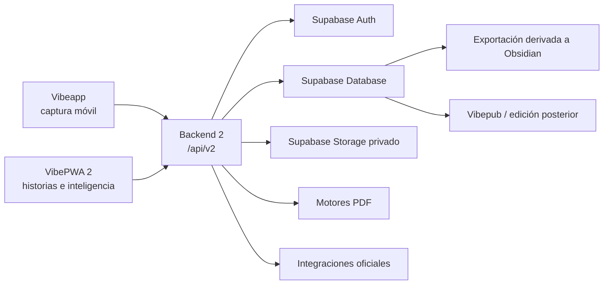

# VibePWA 2 y Backend 2 - arquitectura de producción

Estado: arquitectura objetivo para implementación y migración controlada

Versión del contrato: `2.0.0`

Frontera pública: `/api/v2`

Fuente de verdad: Supabase

## 1. Propósito

Vibe registra hechos multimodales y permite convertirlos después en historias,
análisis y publicaciones. La arquitectura separa dos momentos que no deben
forzarse dentro del mismo flujo:

1. **Capturar:** guardar lo ocurrido con rapidez, incluso sin conexión y sin
   obligar al usuario a definir una experiencia.
2. **Estructurar:** revisar la evidencia, redactar historias, crear eventos y
   producir reportes, hallazgos, publicaciones o conocimiento derivado.

Vibeapp se especializa en capturar. VibePWA 2 se especializa en estructurar y
explotar la información. Ambas aplicaciones usan la misma identidad, el mismo
Backend 2 y los mismos registros.

## 2. Decisiones no negociables

- `/api/v2` es una frontera aislada. No depende de rutas históricas para
  completar una operación nueva.
- Una captura sigue una sola ruta canónica y obtiene un recibo durable.
- Supabase Auth identifica al usuario.
- Supabase Database conserva el catálogo, las historias, los eventos y los
  vínculos.
- Supabase Storage privado conserva los archivos originales.
- El servidor deriva propietario y espacio desde la sesión; no confía en un
  `userId` enviado por el cliente.
- Una captura no necesita historia, experiencia o evento padre.
- Las historias se guardan mediante una operación transaccional: historia,
  eventos y vínculos se confirman juntos o no se confirma nada.
- Un dato ausente se omite. Nunca se convierte en cero, promedio inventado o
  señal positiva.
- Obsidian es una proyección derivada. No es fuente transaccional ni almacén
  primario.
- La interfaz cotidiana oculta la complejidad técnica. Los diagnósticos viven
  en `Cuenta > Operación y diagnóstico`.

## 3. Vista del ecosistema

### Responsabilidades

| Componente | Responsabilidad principal |
| --- | --- |
| Vibeapp | Captura inmediata, cola local, permisos nativos y reintentos |
| VibePWA 2 | Historias, evidencia visual, inteligencia, publicación y cuenta |
| Backend 2 | Autenticación, validación, idempotencia, coordinación y recibos |
| Supabase Auth | Identidad y sesión |
| Supabase Database | Fuente de verdad de datos estructurados |
| Supabase Storage | Fuente de verdad de binarios privados |
| Railway | Ejecución del Backend 2 y motores de salida |
| Obsidian | Conocimiento derivado, curaduría y aprendizaje |
| Vibepub | Edición editorial posterior de publicaciones |

## 4. Dominios del Backend 2

### 4.1 Identidad y espacio

Cada solicitud protegida valida el token de Supabase. El servidor resuelve:

- usuario autenticado;
- espacio de trabajo;
- grupo/persona activo cuando corresponda;
- permisos de lectura y escritura.

Las consultas se filtran por usuario y espacio. Los trabajos, archivos,
historias e integraciones de una cuenta no son visibles para otra.

### 4.2 Capturas

La captura conserva:

- `captureId` estable;
- `idempotencyKey` estable;
- intención: `evidence` o `context`;
- tipo;
- `occurredAt`, que representa la hora real del hecho;
- grupo/persona cuando aplique;
- origen, dispositivo y plataforma;
- texto o referencia al archivo;
- checksum, MIME y tamaño para binarios.

#### Texto y contexto liviano

`POST /api/v2/captures`

El servidor registra la operación, valida el contrato, escribe el catálogo y
devuelve `complete` solamente cuando la escritura es durable.

#### Archivos binarios

1. `POST /api/v2/captures/uploads` autoriza una ruta privada estable.
2. El cliente sube directamente a Supabase Storage.
3. `POST /api/v2/captures/commit` verifica archivo, tamaño, MIME y catálogo.
4. `GET /api/v2/captures/operations/{operationId}` permite consultar el
   resultado cuando hubo timeout o desconexión.

El archivo permanece en el dispositivo hasta recibir `complete`.

### 4.3 Historias y eventos

Una historia organiza evidencia existente; no vuelve a subir archivos. Puede
contener:

- título y narrativa humana;
- fecha o rango temporal;
- área de vida;
- lugar y personas;
- eventos opcionales;
- vínculos a `captureId`.

La escritura usa una función transaccional de base de datos. Si falla un evento
o un vínculo, la historia completa se rechaza. Eliminar una historia devuelve
su evidencia a la bandeja; no destruye los archivos.

### 4.4 Contexto

Biometría, ubicación, clima, noticias, agenda y sensores se almacenan como
contexto. Se consultan por persona y tiempo. No crean experiencias por sí
solos.

- Una consulta médica o una actividad de salud narrada sí puede ser historia.
- Pulso, pasos, sueño o temperatura son contexto medido.
- Una cita de agenda es planificación; solo se vuelve experiencia si el usuario
  relata lo vivido después.

### 4.5 Grupos y personas

El usuario principal puede crear grupos/personas privados para organizar
capturas e historias. Desactivar un grupo:

- impide usarlo en nuevas capturas;
- lo oculta de filtros normales;
- conserva experiencias, archivos, salidas y auditoría histórica.

### 4.6 Inteligencia y publicaciones

Reportes y hallazgos usan hechos y mediciones filtrados por:

1. período;
2. persona/grupo;
3. área de vida;
4. tipos de evidencia o contexto, cuando se necesite.

Las publicaciones pueden incorporar además historias narradas y sus eventos
como hilo editorial. La diferencia es de tratamiento:

- **Reporte:** organiza hechos y mediciones.
- **Hallazgo:** identifica patrones, cambios y oportunidades con nivel de
  confianza.
- **Publicación:** compone una narrativa editorial respaldada por activos y
  mediciones.

### 4.7 Obsidian

La exportación:

- parte de historias confirmadas;
- genera notas y mapa derivados;
- preserva la zona de curaduría humana;
- no borra automáticamente notas curadas;
- no escribe si la ruta no contiene una bóveda válida;
- no puede convertirse en una segunda fuente de verdad.

### 4.8 Integraciones

- **Oura:** OAuth oficial, tokens cifrados, sincronización de colecciones
  autorizadas y webhooks firmados.
- **Apple HealthKit:** lectura nativa desde Vibeapp con permisos granulares.
- **Android Health Connect:** lectura nativa desde Vibeapp; es la vía preferida
  para Android y dispositivos Samsung compatibles.
- **Meta Ray-Ban/Oakley:** los archivos importados por la app Meta AI o la
  galería del teléfono entran como foto o video normal. Los reportes
  HTML/JSON de Meta son datos de cuenta, no sustituyen la descarga multimedia.

## 5. Estados de una captura

| Estado | Significado |
| --- | --- |
| `received` | La operación fue reconocida |
| `storing` | El archivo está en transferencia |
| `binary_stored` | Storage confirmó el binario |
| `cataloging` | Se crea o actualiza el catálogo |
| `complete` | Archivo y catálogo están confirmados |
| `retry_pending` | El mismo envío puede reintentarse |
| `needs_attention` | Hay conflicto o error de integridad que requiere revisión |

La interfaz solo muestra “Guardado” o “Sincronizado” después de `complete`.

## 6. Trabajo sin conexión

La cola local conserva:

- archivo o contenido original;
- `captureId`;
- `idempotencyKey`;
- `occurredAt`;
- checksum y metadatos;
- número de intentos y último error.

Al recuperar conexión, el cliente reanuda la operación con las mismas
identidades. La hora de sincronización no reemplaza la hora original. Un
timeout obliga a consultar el recibo o reintentar; nunca autoriza a eliminar el
elemento local.

## 7. Seguridad

- Auth obligatorio en toda ruta de usuario.
- RLS y filtros de servidor por usuario y espacio.
- Storage privado y rutas separadas por propietario.
- Claves de servicio únicamente en Railway.
- Enlaces de descarga temporales.
- Tokens Oura cifrados.
- Firma HMAC verificada para webhooks Oura.
- Logs sin contraseñas, tokens, claves ni contenido sensible completo.

## 8. Salud operativa sin falso verde

Se distinguen tres niveles:

1. **Liveness:** el proceso está ejecutándose.
2. **Readiness:** configuración, Database y Storage funcionan.
3. **Salud autenticada:** el usuario puede completar el flujo real de captura.

`/api/v2/health/live` no demuestra que Supabase funcione. La promoción exige
también `/api/v2/health/ready` y una prueba autenticada con escritura, lectura
y eliminación en Storage. Un despliegue puede estar vivo y, aun así, quedar en
estado `degraded`.

## 9. Compatibilidad y experiencia de usuario

VibePWA 2 ofrece ES, EN, FR y PT completos. Una función no se considera
terminada si:

- falta texto en alguno de los cuatro idiomas;
- obliga al usuario a comprender términos internos;
- no confirma resultado;
- muestra controles operativos fuera de Cuenta;
- cambia de diseño o comportamiento entre escritorio, tableta y móvil.

## 10. Criterio de terminación

La arquitectura se considera operativa cuando:

- todos los tipos de activo completan la ruta canónica;
- los reintentos no duplican;
- el modo offline conserva hora y contenido;
- las historias son transaccionales;
- los filtros por cuenta, persona y período son correctos;
- los PDF no pierden activos ni mediciones;
- Obsidian recibe únicamente derivados consistentes;
- Oura y conectores móviles fallan de forma visible y recuperable;
- no existen rutas protegidas que acepten autenticación inválida;
- el despliegue puede revertirse sin pérdida de datos.
