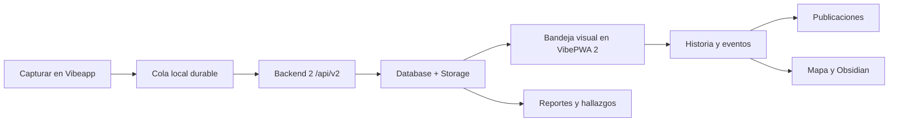

# VibePWA 2 - flujos operativos

Estado: guía funcional y operativa de Backend 2

Contrato relacionado: `docs/vibepwa2-backend2-architecture.md`

## 1. Dos trabajos, una sola fuente de verdad

Vibe separa captura y estructuración para que cada tarea ocurra en el momento
adecuado:

- **Vibeapp captura:** texto, voz, foto, video, documentos y contexto móvil.
- **VibePWA 2 estructura:** revisa, adopta, narra, analiza y publica.
- **Backend 2 y Supabase conservan:** identidad, archivos, catálogo, historias
  y vínculos.

La separación no crea dos bases de datos. Todo termina en el mismo registro.

## 2. Flujo general

Una evidencia puede permanecer sin historia y seguir participando en reportes,
hallazgos o publicaciones según el alcance elegido.

## 3. Flujo por tipo de activo

### 3.1 Texto y voz transcrita

1. Vibeapp asigna identidad y hora original.
2. Conserva el texto en la cola local.
3. Envía JSON a `POST /api/v2/captures`.
4. Backend 2 valida, registra y responde `complete`.
5. VibePWA 2 lo muestra en Evidencia.

Si el texto cuenta qué vivió la persona, puede convertirse en narrativa humana.
Una etiqueta o nombre de archivo no es narrativa.

### 3.2 Imagen

1. El móvil conserva el original.
2. Calcula SHA-256, MIME y tamaño.
3. Solicita autorización de carga.
4. Sube a Storage privado.
5. Confirma el commit.
6. El servidor verifica el archivo y crea el catálogo.
7. VibePWA muestra una miniatura, no un identificador técnico.

OCR o visión automática enriquecen la evidencia, pero no sustituyen el relato
humano.

### 3.3 Audio

Usa la ruta binaria. El archivo original queda preservado. La transcripción
puede ser narrativa si contiene un relato humano real.

### 3.4 Video

Usa carga directa reanudable cuando el tamaño o la red lo requieran. El video
se presenta con miniatura y controles de reproducción. Si contiene voz, la
transcripción puede aportar narrativa; el metraje sin voz es evidencia visual.

### 3.5 Documento

Se guarda como binario. OCR, resumen o interpretación son derivados. Un
informe, examen o paper es un artefacto; no se convierte automáticamente en
experiencia.

### 3.6 Biometría y sensores

- Muestras pequeñas viajan como JSON.
- Exportaciones históricas viajan como archivo.
- Se conserva la hora y la fuente.
- Un valor ausente se omite.
- Nunca se interpreta sueño no medido como cero horas.

HealthKit y Health Connect se leen desde Vibeapp. La PWA solo ofrece importación
de respaldo o recuperación.

### 3.7 Ubicación

Se almacena como contexto con fecha, coordenadas y precisión. Puede ayudar a
agrupar evidencia o enriquecer una historia, pero no crea una historia sola.

### 3.8 Clima y noticias

Vibeapp aporta el contexto cercano al momento. Backend 2 lo normaliza y puede
completarlo con fuentes externas. El guardado del hecho no espera una consulta
lenta; el enriquecimiento se registra como trabajo posterior observable.

### 3.9 Agenda

Una cita se guarda como planificación. No crea experiencia ni evento vivido. Si
el usuario relata después lo ocurrido, VibePWA puede crear una historia y
referenciar la agenda como contexto.

## 4. Captura sin conexión

1. El usuario captura normalmente.
2. La cola indica “Se enviará cuando vuelva la conexión”.
3. El elemento conserva la hora original y no desaparece al cerrar la app.
4. Al reconectar, Vibeapp renueva la sesión si hace falta.
5. Reutiliza el mismo `captureId` e `idempotencyKey`.
6. Reanuda el archivo desde el último byte confirmado.
7. Solo elimina la copia local cuando el servidor responde `complete`.

Si el servidor ya había terminado antes del timeout, el reintento devuelve el
mismo resultado sin duplicar.

## 5. Bandeja y adopción visual

VibePWA 2 organiza la evidencia por:

- fecha;
- persona/grupo;
- tipo;
- cercanía temporal a la historia;
- estado: pendiente o vinculada.

La interfaz muestra:

- miniatura para imagen y video;
- reproductor para audio y video;
- extracto para texto;
- nombre legible e icono para documento;
- resumen claro para contexto.

El usuario selecciona lo que pertenece a la historia. La evidencia no elegida
permanece disponible.

## 6. Historias y eventos

### Crear

1. Elegir persona/grupo y fecha o rango.
2. Revisar evidencia sugerida.
3. Escribir o dictar la narrativa.
4. Elegir área de vida cuando corresponda.
5. Añadir eventos opcionales.
6. Guardar todo en una transacción.

### Editar

Se puede cambiar narrativa, título, período, área, lugar, personas, eventos y
evidencia vinculada.

### Reorganizar

Se permite:

- quitar evidencia sin borrar el archivo;
- unir historias;
- dividir una historia;
- convertir un evento en historia;
- mover una historia como evento de otra;
- eliminar una historia y devolver sus activos a la bandeja.

Cada operación conserva trazabilidad. Una reorganización no debe dejar
duplicados activos ni huérfanos silenciosos en Obsidian.

## 7. Grupos y personas

El usuario principal administra sus grupos/personas en Cuenta. Cada captura e
historia queda asociada al valor seleccionado. Si no hay grupos, se usa el
usuario principal sin bloquear el flujo.

Desactivar no significa borrar. Los datos históricos permanecen disponibles
en consultas y salidas autorizadas.

## 8. Reportes, hallazgos y publicaciones

### Selector común

1. Período.
2. Persona/grupo.
3. Área de vida, opcional.
4. Base de información:
   - todo lo registrado;
   - historias confirmadas;
   - evidencia.

### Reportes

Ordenan actividad, cobertura, mediciones y evolución. Deben declarar qué datos
existen y cuáles faltan.

### Hallazgos

Separan:

- observación comprobable;
- interpretación;
- nivel de confianza;
- siguiente acción redactada de forma humana.

### Publicaciones

Pueden usar historias y eventos como hilo narrativo, más los activos y
mediciones seleccionados. El PDF y, si hay videos, el paquete editorial,
mantienen orden cronológico y referencias claras.

## 9. Obsidian

1. VibePWA prepara una vista previa.
2. Valida que la ruta sea una bóveda real.
3. Exporta historias confirmadas y activos referenciados.
4. Regenera la zona automática.
5. Preserva la curaduría humana.
6. Reporta candidatos obsoletos para revisión; no los borra en automático.

El mapa debe usar el mismo conjunto exportable y las mismas reglas que las
notas.

## 10. Integraciones de salud

### Oura

1. El usuario conecta su cuenta mediante OAuth oficial.
2. Backend 2 cifra los tokens.
3. Sincroniza colecciones autorizadas.
4. Los webhooks válidos crean trabajos durables.
5. Los datos se normalizan como contexto.
6. Desconectar revoca el vínculo y deja intactos los datos históricos según la
   política de retención.

### Apple y Android

- Vibeapp solicita permisos granulares.
- HealthKit o Health Connect entregan datos al móvil.
- Vibeapp envía muestras normalizadas por `/api/v2`.
- Samsung/Galaxy se integra preferentemente mediante Health Connect.

## 11. Fallos y reintentos

| Situación | Respuesta del sistema |
| --- | --- |
| Sin red | Conservar y reintentar |
| Sesión vencida | Renovar una vez y repetir |
| Timeout | Consultar recibo antes de duplicar |
| Storage temporalmente indisponible | `retry_pending` |
| Archivo distinto con la misma clave | `needs_attention` |
| Dato inválido | Rechazo claro; conservar para corrección |
| Enriquecimiento externo fallido | Trabajo pendiente o fallido visible |
| PDF fallido | Error visible; no descargar sustituto silencioso |
| Obsidian inválido | No escribir y explicar la ruta requerida |

## 12. Operación diaria

El usuario común solo necesita:

- estado de sincronización;
- elementos pendientes;
- causa comprensible cuando algo requiere atención.

La operación técnica muestra:

- versión de aplicación y contrato;
- liveness y readiness;
- Database y Storage;
- trabajos pendientes o fallidos;
- última etapa confirmada;
- identificadores necesarios para soporte.

## 13. Cuatro idiomas

ES, EN, FR y PT tienen el mismo alcance funcional. Mensajes, formularios,
errores, confirmaciones, ayuda y operación deben estar traducidos. El idioma no
modifica los datos almacenados ni la lógica del servidor.
