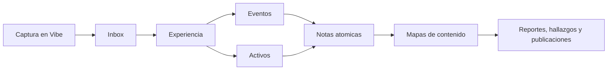

# Metodo Karpathy adaptado a Vibe

Esta boveda toma como inspiracion una forma de trabajo centrada en aprender haciendo, escribir notas pequenas, enlazar ideas y convertir evidencia cruda en conocimiento reutilizable.

## Principios

1. Capturar rapido, ordenar despues.
2. Una nota debe explicar una idea clara.
3. Toda nota importante debe enlazar a experiencias, eventos, personas, activos o mapas.
4. El conocimiento util debe responder una pregunta concreta.
5. Lo repetido se convierte en mapa de contenido.
6. Lo accionable debe terminar en una decision, recomendacion o siguiente paso.
7. La evidencia original no se mezcla con la interpretacion.

## Flujo recomendado

## Como se explota

- Experiencias: memoria cronologica.
- Eventos: granularidad interna de una experiencia larga.
- Activos: evidencia verificable.
- Notas atomicas: aprendizajes, patrones y conclusiones.
- MOC: tableros vivos para navegar temas.
- Publicaciones: salida final editada para compartir o archivar.

## Criterio de calidad

Una nota esta lista cuando una persona puede leerla y entender:

- que paso
- por que importa
- que evidencia la sostiene
- con que se relaciona
- que accion o aprendizaje deja

